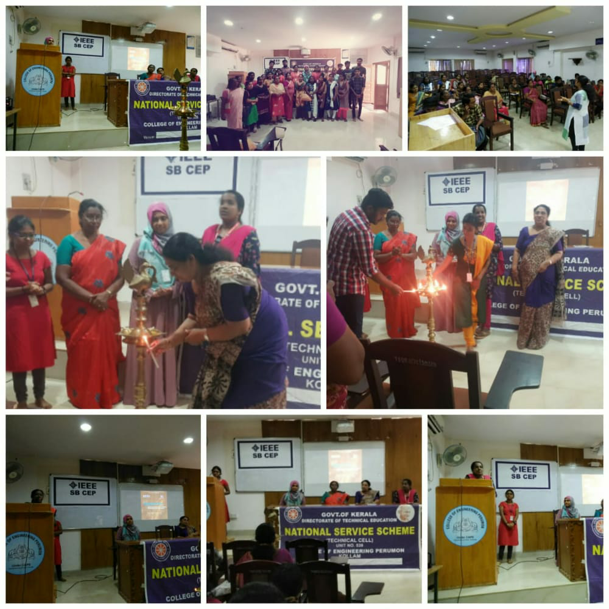

## DIGITALIZATION-OFFLINE

```Date: 29/02/2020```<br />
``` No. of Participants: 53```



It was an awareness session for kudumbasree members conducted on behalf of Women’s Day celebrations. The session was really useful for them to get familiar with the online transactions, registrations etc.
 
## QUARA CREATIVATE-ONLINE

```Date: 22/04/2020  ```<br />
```No. of Participants: 45```

It was an event conducted to find the best creative works during the lockdown days. 


## BE FIRST QUIZ-ONLINE

```Date: 17/04/2020  ```<br />
```No. of Participants: 47```

It was an online quiz competition. It mainly covered all the inspiring women.

## MIMAMA-ONLINE

```Date: 10/05/2020 ```<br />
```No. of Participants: 45```

It was an online diary writing competition conducted on behalf of Mother’s Day celebrations.