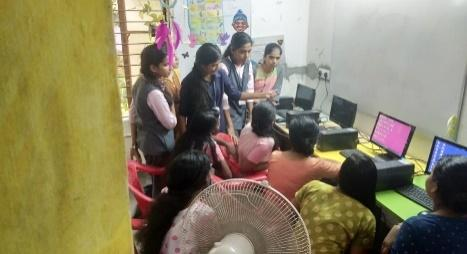

## Nirbhaya Classes

```Date:  4th and 5th of March, 2020```
```No of participants: 10```



The classes were held to familiarize the inmates of Nirbhaya home with Microsoft Word and Powerpoint. At the end of the two-day session, they were able to insert tables, create flow charts and prepare presentations.

## Project Coding 

```Date: 18th April, 2020```
```No. of Participants: 20```

The event is done in collaboration with the IEEE CS Chapter of LBSITW. This is a weekly event conducted in the aim of improving the coding skills of individual participants. Topics are given along with study materials during the start of the week and a test is conducted based on the topics at the weekend. 
 