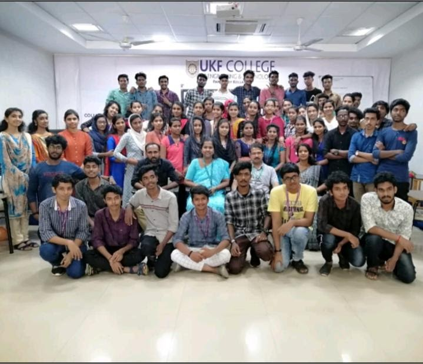

## REPUBLIC DAY-OFFLINE

```Date:  25/01/2020```
```No. of Participants: 74```



It was an event conducted on the occasion of Republic Day. Several competitions were held at this event.
 
## MATAYA-ONLINE

```Date:  10/05/2020```
```No. of Participants: 28```

It was an online letter-writing and selfy contest competition conducted on behalf of mother's day. Certificates were provided to the participants.
